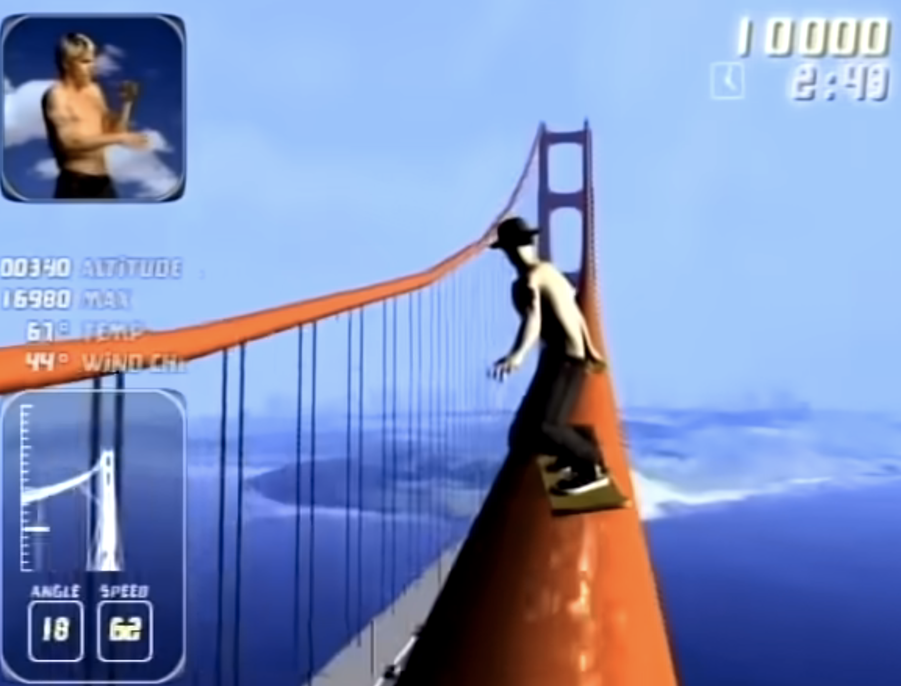
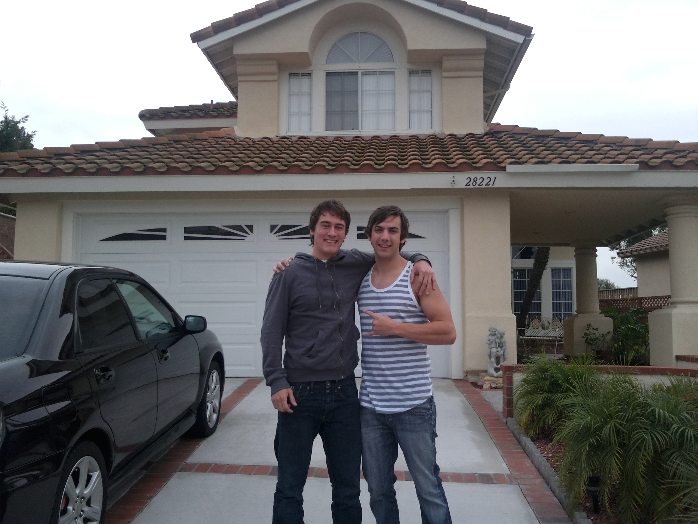
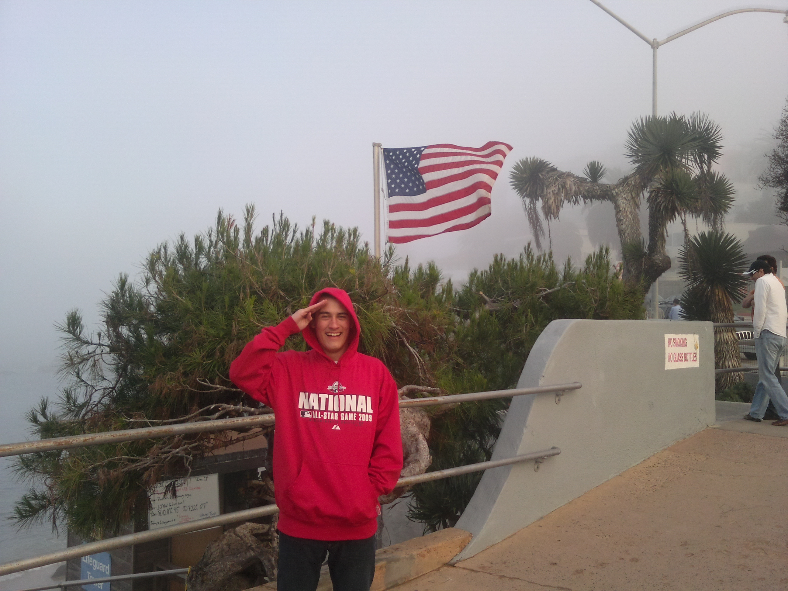
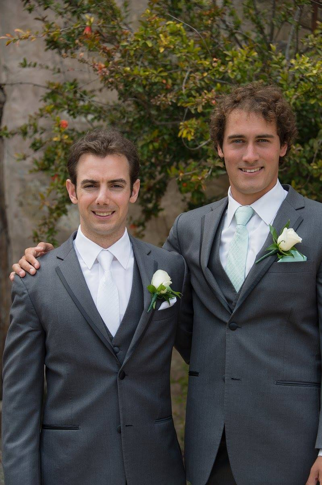
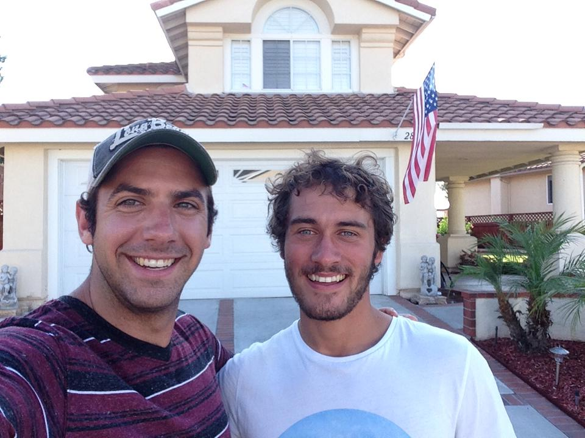

---
title: California Love
date: 2021-07-25
reading_time: true 
share: true 
profile: true
comments: true
featured: false
image:
  caption: privacy
  focal_point: ""
  placement: 2
  preview_only: false

---

During my teen years, I was a gamer. My fascination, addiction actually, to the screen which immersed me in other, more vivid, worlds was cathartic. This was a time when video-game technology was increasing rapidly. Games were becoming clearer, more life-like, and much more captivating. Online gaming was also skyrocketing; regular games were being made with connectivity front of mind. Previously, I'd get lost in the artificial arena of the simulated world. Now, I was being plunged into other cultures on our planet, by communicating with people from all over the world - whilst I shot at them.

Around the age of six, I received my first games console. It was a SEGA Megadrive, and came with a stocky cartridge containing the game 'Sonic the Hedgehog'. I devoured Sonic the Hedgehog almost daily for years to come. But I'm pretty sure I never completed it. I never could beat the Boss on the third stage. This is not exactly a testament to my gaming ability - I was never destined to win millions in eSports. 

In the years after my Sonic days, games fluttered in and out of my life. I wasn't a total recluse. My youth consisted of roaming around urban streets like a stray cat without a bell; skateboarding and cycling with friends, throwing stones at each other, playing in derelict areas,?and building tree-houses in overgrown no-mans-land.

We moved around a lot while I was young, so I was used to meeting new kids and picking up new hobbies from them; whatever the local kids were doing, to at least attempt to fit in. Eventually, though, my youth was finally granted an element of stability and from the age of thirteen I settled in at my Great Grandmother’s house.

I loved my Great Grandmother. She was a calming presence, stoic and strong, frugal and steadfast. She didn't suffer fools and didn't care for the melodrama of the world. Born in 1925 into a comfortable family, Grandma Evelyn, as I referred to her, lost her father at the age of three years old. The family, including five children, was plunged into poverty overnight. The UK didn't have a social support system back then and so families without a working man were left to fend for themselves. I'm not sure how they did, and my Grandma Evelyn didn't complain about it in her old age, but I'm aware she endured a level of hardship that is unknown even to people in poverty in the Western world of 2021.

I soon made friends in the neighbourhood who were gamers. Online gaming was on the precipice of being widespread but was still straddling an age of dial-up and broadband internet. Thus, split-screen gaming was all the rage – which involved kids congregating, square-eyed, around a television that had its screen divided. As I lived alone with my Grandma Evelyn, in a spacious terraced house, one of the rooms became our gaming denizen.

That first summer, while I was still 13, my new friends and I spent almost the full six weeks of the holiday inside of the den, curtains closed, a dozen stinky shoes at the door, raptured by *Halo 2* and our fight to save humanity. My Grandma Evelyn wasn't pleased by the amount of time we were spending indoors playing games, nor was she smitten by the stinky shoes. One evening Grandma Evelyn said to me that we were using too much electricity by playing in the house all day and that I was going to have to start charging my friends for coming over to play. 

Needless to say, I was outraged by the proposition of charging my 13-year-old friends money to play games with me at home and so protested. But Grandma Evelyn was adamant. The next time my friends came over, I charged them entry to play. I don't remember how much, probably less than one pound sterling. I summarily delivered the tribute to Grandma Evelyn. With hindsight, I'm quite certain Grandma Evelyn was growing weary of the house being full of kids and just wanted us to go play in the fields. Or she might have just been an 80-year-old hustler, looking to top-up her state pension.

Shortly after this time, due to my tenacious requests, Grandma Evelyn bought me a new games console, an XBOX 360. The local kids and some new high school friends had inaugurated me into the modern era of gaming, which had undergone some serious developments since my Sonic days, and I was wonderstruck with my new passport to uncover distant lands.

One evening, my school friend and I were waiting in the lobby of the online multiplayer version of *Splinter Cell Double Agent*. Incessantly chatting away, our little on-screen avatars were lighting up like a firework display every time we muttered or giggled. We weren't alone in this room, as the online game required six players divided into two teams. New characters were swiftly popping up on-screen and the poor souls were bombarded with our school-boy cacophony. 

One of the new arrivals found our incoherent ramblings to be hilarious. After listening in for a while, he introduced himself to us. Online gamers use pseudonyms to enable a level of anonymity, but the mystique is often quickly broken down if a rapport is built amongst players. In our case, we were soon playing along in the undercover world with our new American spy friend, Dennis.

I quickly became friends with Dennis. I was enthralled listening to his description of the area where he lived, and the school he attended. I was fascinated by his Californian life, I perceived it to be vastly different from my own. It seemed like Dennis lived in an alternate reality, where the sun was always shining, and life was easy and carefree. 

I was already vaguely aware of California. My favorite band, was, and is, the Red Hot Chili Peppers, the lead singer of whom struggles to write lyrics without paying homage to his adopted state. The number of songs written about the Golden State is huge. I should probably fact-check this, but I'd guess that more songs are glorifying California than any other place on Earth.

As Dennis and I communicated with greater frequency, our bond grew. At some point, we thought it would be interesting to look on Google Earth and gain a bird's eye view into each other's lives.

I typed Dennis' address into the search bar and was swiftly transported more than 8494 kilometers around the globe to a pristine and manicured landscape juxtaposed against the vast expanse of the Pacific Ocean to which it clung.

Dennis did the same and thought that he had accidentally opened up the Victorian edition of Google Earth as he was greeted with rows of terraced houses stuck in rigid lines like lego blocks, with chimneys poking from the roofs.

Over the weeks and months proceeding this time, Dennis and I would chat almost every day while playing games online. I was introduced to his brother, Chris, who was studying at UCLA. Everything sounded so exotic. My mind conjured images of a place where people had untold possibilities and affluence at their disposal. 

Eventually, we grew tired of playing the same video game and decided to both purchase webcams, for the XBOX, so that we'd be able to meet visually for the first time, as opposed to greeting each other as mercenary caricatures of ourselves.

These days, we take for granted the ability to FaceTime, Zoom, or Skype our friends and family. But back in the mid to late 2000's it was still a novelty. Dennis and I were elated to be able to chat in person over video. I remember introducing Dennis to Grandma Evelyn, who I'm sure had no idea what she was witnessing. I was delighted to greet Dennis' family over the net too.

Before long, Dennis and I had both begun to play games less frequently and began to slowly lose contact. Neither of us had ever communicated via any other channel other than the XBOX messaging system. Back then there was no WhatsApp or equivalent and we didn't use Facebook much either. I began to hang out with friends in the neighborhood, which inevitably led to getting in trouble and being a nuisance. I had once again left the safety of the gaming den and was roaming the streets with my larrikin mates.

Some years passed, with less and less contact between us, with the occasional update during the intermittent times we both played. However, neither of us ever forgot the other, and I held a deep-seated desire to visit California when I was able to. 

When you're young, and yearning for freedom and escape from the monotony of a life that you aren't interested in, time feels like it isn't ticking away. But suddenly, you find it has passed and you're grown. You're becoming a man of the world. Able to forge your destiny, carve your paths and lead the life you want. You might have been conditioned to think otherwise, by family or friends that know of no other way to live. But if you have the courage, you're able to go where you please and take the random opportunities that life throws at you.

Eventually, time passed for me. I was on the verge of turning eighteen. I'd had a job over the Christmas period and saved some money. Plus, I'd been given some cash for Christmas and my birthday. I knew what I wanted more than anything. I was going to California.

My Grandma tried talking me out of it, "Why don't you visit London? You've never been there and it would be a good start?".  
It was true. I'd never stepped foot in the capital of my home country, and I had no urge to do so.  I'd witnessed London on T.V and thought it looked just as dark and dreary as the current place I found myself. 

It was mid-winter when I decided to commence my odyssey. I booked return flights to Los Angeles. The day I traveled to the airport to get my flight to California, I was a bundle of excitement and energy. I was apprehensive about leaving my Grandma Evelyn, who was now 85, but I knew she had her daughter to check on her while I left the roost. I'd just turned eighteen and I hadn't left England since I joined my friend and his family on a trip to France some five years prior. I had done little to no planning for the trip, other than book myself into a hotel on Venice Beach.

You'd think after years of contemplating visiting California and Dennis that I would have done my homework. But back then, homework and I didn't get along. I was following my nose and gut instinct. Being led by the wind and any impulsions that arose. I possessed confidence in great supply and an ability to chat to practically anyone I met. I wasn't nervous in the slightest.

I spent ten days in Los Angeles, wandering around, gleefully lost, with no itinerary, exploring the home of my imagination. I tried in earnest to climb up close to the Hollywood sign, to no avail, and was given a dog-eared map of the Hollywood Hills by an elderly man who was outside washing his car. I wish I kept that map.

I had my first ever surfing lesson with a stereotypical Californian surf instructor who picked me up in a beat-up car and drove us up the Pacific Coast Highway to Malibu, whilst the Flight of the Conchords played out of the tinny speakers. I'd never heard of New Zealand's fourth most popular folk-rock duo until this juncture in my life and they became a waggish reminder of my exploits on the California coast.

Looking back on all of my escapades during this time, I was never nervous or concerned for my safety. I would talk to anyone willing to converse and because of this I met countless interesting people, old or young, and had wonderful conversations. People must have found me quite peculiar, sometimes maybe, endearing. A young eighteen-year-old rambling around, clearly unperturbed by any potential dangers. Free.

At some point during my stay, I had a call with Grandma Evelyn. She had been rushed to hospital, the medics weren't sure what was wrong, but she seemed stable and happy. She told me she loved me and to enjoy the rest of my trip. I was concerned about Grandma Evelyn, but I was reassured that she sounded in good spirits and I was too wrapped up in my Californian experience to be too dismayed.

While I was in Los Angeles, the thought of trying to meet Dennis occurred to me, but it had been quite a long while since we had contact and I wondered if he would even be interested in meeting me anymore. What's more, I didn't even have any feasible ways to contact him. We'd never exchanged mobile numbers. I didn't remember his email. I wasn't on Facebook. I didn't have an XBOX to hand. I decided to forget about it and enjoy the rest of my trip.

I returned home from California and went to visit Grandma Evelyn in hospital. She was going to be okay, this time. She was in her usual high spirits, cracking jokes, unfazed by her current plight. She was from a generation who didn't do feeling sorry for themselves.

Soon after, I returned to my normal life, went back to school, and reminisced about my Californian journeying. Eventually, Grandma Evelyn returned home but her health had deteriorated quite significantly in a matter of weeks. On March 5th, 2010, I was awaken from my slumber by the ringing of a bell. Grandma Evelyn would use a little bell to get my attention through the house rather than shout or have to climb the stairs to reach me. I hated the sound of that bell, waking me up for school every day.

On this occasion, however, the bell wasn't being used to wake me for school. I reluctantly left my warm bed and paced to my grandma's bedroom. She was breathless and pale. I knew something was awry and called an ambulance. Grandma Evelyn knew what was happening and accepted her situation with grace. She said her goodbyes to me whilst I perched next to her on her bed.

Later that day, in hospital, with wires and tubes trailing in and out of her small, frail body, I sat beside my Grandma Evelyn and held her hand as the nurse said she was taking her last breaths. Upon hearing this, in total disbelief, I felt like I was sucked into a black hole, time stood still and I was shellshocked. Grandma Evelyn stopped breathing moments later, and I mentally imploded.

There was no longer any good reason to remain stationary in the town that had been my home and I felt no attachment to it now that my grandma had moved on beyond the great divide. Within a matter of weeks, I had packed up my few worldly possessions and left the country. For the next nine months, I called Rome, Barcelona, and Copenhagen home for extended periods. I engaged in a youthful, wild summer romance, drank red wine on beaches as the sunset, traipsed around cities aimlessly, worked in bars, ate exotic foods, bought new clothes, and befriended many strangers.

During this period, after having reacquired Dennis' email somehow, I rekindled our pen pal friendship. We engaged in spontaneous correspondence and updated each other about the developments in our lives. However, the dispatches were short-lived and we were soon out of touch again.

Over the years, my maladministration caused me varied tribulations; including missing flights, losing money, and taking wrong turns. It all added to the adventure I suppose. But unfortunately, it also meant that I could easily lose connections. Dennis happened to be one such person who would unknowingly be implicated in my organizational amnesia. 

Along the way in my European escapade, whilst working in Copenhagen, I happened to meet a British ex-Army soldier, probably six or seven years my senior. He had served in Iraq and, looking back, was attempting to free himself of his demons. As fate would have it, soon after he toured Iraq he went AWOL and had hunkered down in a hostel in San Diego in return for taking care of the rooms for a few hours each day. Hearing of this, I implored the veteran to put me in touch with his friends who managed the hostel.

I was informed that if I got myself to San Diego, a bed would be waiting for me in the hostel with the potential of an arrangement for free accommodation in return for light duties. I was eager to leave Copenhagen. The Danish winter was setting in; I was living in a basement with other young, lost souls, in a house that belonged to a pub owner. It was damp and frigid. The California siren was calling me.

I left Denmark as quickly as I came. Making a beeline for Copenhagen airport to seek warm refuge in a familiar culture. I felt like I was going home.

I arrived in San Diego with little money and few material goods. I hollered a taxi and asked to be taken to the hostel in Pacific Beach. The warm, dusk air smelled familiar and the environment felt welcoming.  

Upon arrival at the hostel, I checked in, stated my purpose, and laid claim to the land. Exhausted from my journey, I fell into a lower bunk and drifted to sleep. 

Unusually, my first couple of days in San Diego experienced inclement weather, so I bunkered down in the hostel. Content to be back on what felt like home ground. I made pancakes for breakfast and chatted to the backpackers.

After being in town for a few days, the weather settled into its regular pattern of day-in-day-out sunshine and mild temperatures. On this signal, I spontaneously decided I was going to do what I should have done on my first visit to the state - I was going to find Dennis.

Characteristically, I'd lost touch with Dennis once again during my ramblings in Europe, and at this point, I didn't have a working phone for use with an American SIM card. Nonchalant, I set forth from San Diego railway station to venture up the surf line track. 

Ever since the days of our satellite reconnaissance missions, I had memorized the birds-eye view of Dennis' family home. I also remembered the city in which he lived and thought that I was pretty sure about the name of his street. I didn't, however, remember the street number and so I was clueless as to what I was going to do when I arrived in the area. Clueless, but confident and a lateral thinker. I was sure I would find Dennis.

I departed the train in an unfamiliar industrial area. Trains aren't a frequently used method of transport in California, they exist merely as a relic from a previous age, and not every town had a railway station, including the town I was looking for. The car is king here, as the Beach Boys professed.

Looking around the station area, there wasn’t anyone around. The place was desolate. Thinking about my strategy, I decided the best course of action would be to ask someone for directions to the street that I had in mind. I could see a gas station across the street so I headed over.

The attendant inside informed me that he’d never heard of the street I was looking for but that he could call me a taxi, if I liked. He could call one if I liked? I took the offer.

The taxi arrived and I eagerly jumped in. "Where are you heading?" the driver queried. The driver was puzzled that I didn’t know the house number, but proceeded to pull out of the gas station and we were on our way. As we started making ground to the destination, landmarks began to seem more familiar to me. I recognized the curvature of the streets and when we got closer to the neighbourhood and passed some tennis courts I knew we were in the vicinity of Dennis' house.

The driver let me know that we had reached the street. Rummaging through photographic collections in my head, I recalled that the house was situated on the curve of the road, but I couldn't be sure. I asked the driver to stop the car. I would proceed the remainder of the journey on foot to get a feel for my surroundings. I strolled down the road, scrutinizing the Mediterranean-style properties for signs of Dennis. I'm not sure what I expected. Did I expect Dennis to be peering out of the window longing for my arrival? I don't know. I think that I was just a young man on a mission. A mission to find a friend. 

The street was empty. Devoid of signs of life. Americans live in their home or their cars. There isn't much going on in the space between. I was getting closer to the curve of the road. The spot where I hoped I would immediately recognize Dennis' house. As I drew nearer, I spotted a young man approaching his car. He looked like he was just about to get in, but before he could, I approached him and politely asked if he knew where my good friend Dennis lived. 

The young man gave me a quizzical, suspicious look. He must have been wondering why a young guy had just arrived, without a car and speaking in a strange accent. His facial expression changed quickly after evaluating the situation and realizing that I looked pretty harmless. He replied, "Dennis is my brother".

I looked back at him, beaming, and exclaimed, "Chris!? It's Sam!". 

Chris remembered who I was and was in disbelief. Although, ever the cool character, he remained collected while I was excitedly babbling about my journey to find Dennis. Chris explained he was just about to head out somewhere in his car and that I had caught him at an unbelievably happenstance moment. He explained that Dennis was out with a friend and that nobody else was home. Furthermore, it was the middle of the day. All the neighbors were at work. The chance that I'd have successfully found Dennis if Chris didn't happen to be strolling out to his car at this fortuitous moment was slim to non-existent. 

Chris got on his phone and called Dennis. Dennis, who was out running on the beach with a friend, promptly answered. The conversation went along the lines of;
Chris: “Dude you are not going to believe who's here!”
Dennis: “Who?”
Chris: “XBOX Live”
Dennis:...
Dennis: “Sam???!”
Chris: “Yup!”

Dennis, incredulous that his childhood online friend could be waiting at his doorstep, let Chris know that he'd be right home.

Chris welcomed me into their family home and offered me a drink. We chatted about my quest to find Dennis and the events that had led to me being in California.

Soon enough, Dennis arrived home with his friend that he'd been galloping along the beach with. We were all exuberantly jabbering away and jovial at the remarkable situation. Dennis and I gave each other a friendly hug and reminisced about our XBOX days.

I remained in San Diego for about six weeks after meeting Dennis. During that time, Dennis came down to see me. He picked me up in his speedy Subaru and showed me some of the sights of the town. We dined at the Old Spaghetti Factory in the Gaslight district, courtesy of his parents. I was so pleased to have found my friend and both of us were still ruminating on how fate had enabled it to occur.

Dennis departed San Diego after his day trip and I was left contemplating what to do with the rest of my life. I felt like I had achieved a mission. I had accomplished a self-imposed pursuit, from which I'd derived an element of temporary purpose. I spent down to my last five dollars. With that five dollars, I took the train to the U.S border with Tijuana and crossed into Mexico. I was seriously considering leaving the life I had behind me and just getting lost in Mexico. I hadn't informed anyone of my plan. I didn't have a plan.

My Mexican vagabond romanticism was short-lived. I recognized I was on a precarious path. After nearly 12 months out of the United Kingdom, I decided to return and leave my prodigal ways behind me.

Soon thereafter I joined the Royal Navy, to set me on the straight and narrow. But before I did, I went back to California to stay with Dennis and his family for ten full days. 

During this trip, Dennis, Chris, and I bonded. We had a glorious time and my friends were tremendous hosts. We went snowboarding at Big Bear Mountain, went to Disneyland in Anaheim with Dennis' girlfriend, and I was inducted into the Southern Californian fast-food culture; including In-N-Out Burger, Chick-fil-A, Jack in the Box, Chipotle, Panda Express.... (List is not exhaustive). 

It was clear, what started as a chance encounter while playing an online video game had flourished into what would become a lifelong friendship. California would forever hold a place in my heart and feel like a second home. Indeed, when I was nineteen, I had the California flag tattooed on my chest, sealing the state firmly a part of my identity and being.

In the time since our initial real-life reuniting, Dennis, Chris, and I have stayed in touch, year after year. Going back to California to hang out with them has often marked important events in our lives and delineated personal transitions. A Californian excursion bookended my time in the Navy, and whilst I was at University I went back and was honored to be one of Chris' groomsmen at his wonderful wedding in Monterey, Northern California. When I met my partner in 2012, after only five months of our relationship, I took her to San Francisco for New Year and my 21st Birthday, allowing her to gain greater insight into my character.

I write this piece in 2021, during the COVID-19 pandemic, which has provided me with space to muse about the life I've lived so far. I've considered the events, people, passions, and ideas that have shaped me. Unfortunately, I haven't been back to California since 2016. In 2018, I broke tradition by not partaking in my biennial trip to California and instead moved with my partner to Australia where we continue to live. Dennis and I still keep in touch regularly, swapping updates of our lives, talking politics and other topics. Funnily enough, never gaming.

I look back on my venture and see a boy who was searching, looking for meaning, seeking identity and belonging but also in love with his freedom in the world. Along the way, I was tested and faced tribulations, but I also experienced the generosity of humankind everywhere I went. A comparatively limited number of experiences that have sculpted me over that time went into the tale that you have read. But what I'm sure is clear to the reader is the power of true friendship, dreams, and Californication.

 

 

