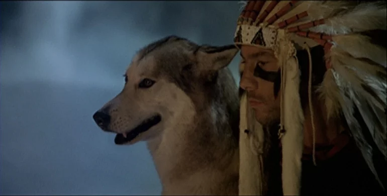

Nearly four years ago, I found myself volunteering on a lavender farm in Canada. Sounds idyllic, I know. It was a fortuitous place to arrive, as my initial landing place in that vast open land was a dilapidated, post-apocalyptic Bunkeresque smallholding owned and operated by a reefer smoking, middle-aged, married couple. I was, after all, in British Colombia, home to the infamous BC bud, where attitudes towards the production and consumption of marijuana are lax. I felt like I had suddenly been thrust into a locus of the video game San Andreas.

The male proprietor of this little Thoreauvian spot went by the name Alyx. I first had contact with Alyx over a messaging service via the website WWOOF (Worldwide Opportunities on Organic Farms) and was attracted to the location of the property on Vancouver Island, its remoteness and alluring, untamed wildness. I was in my final year of my undergraduate degree and craving adventure; tired of the stifling life of examinations, sitting behind books, beholden to a rainy city and an institution. I also wanted to use my hands and do something real in the world, the opposite of what a student life entails. 

Whilst revising for my final exams, I would often procrastinate and look on Google Earth at all of the places I might escape to.  Canada, the second largest country on the planet, and the largest English speaking, was enticing. Its grand scale and natural beauty unparalleled. I imagined Canada would provide me with the necessary natural revitalisation that I required. 

So it was, after a brief amount of correspondence with Alyx, and after taking my exams and bidding my girlfriend farewell, that I set out on my adventure. I was eager to see Canada in all its might, befriend strangers, and learn skills of self-reliance in the great outdoors. 

A couple of aeroplane and ferry rides later, I was on Vancouver Island. Alyx greeted me in his rusting, pickup truck at a gas station and drove us through winding highways to his abode.

The patchwork property was perched on a hillside next to a highway with nothing around but trees. To get anywhere required driving. I hadn't necessarily considered this fact when choosing my first destination in Canada. After two days habitation in Alyx's ramshackle, pot-hazed, "house" in the middle of nowhere, I realised I'd made a grave error and my Jack London style romanticising may have been naive. 

Nevertheless, I wasn't yet ready to give up on my British Columbian wandering and so on my third day in the province, I tried my thumb at hitch-hiking. This turned out to be a remarkably easy and rewarding experience in which, without let or hindrance, I arrived in the capital of Vancouver Island, Victoria, a matter of hours after making my decision to depart from Alyx's wild kingdom. 

Still feeling a strong desire to work with my hands, I decided to try finding a more appropriate farm - one last time. 

I ended up gaining a volunteer position on a large, beautiful property surrounded by forest and straddling the sea. Instead of sleeping on the floor in a grimy room, I lay on a snug bed in a festival style bell tent overlooking newly sown fields with fragrant, juvenile lavender. 

My experiences on this farm were wonderful and I met many interesting characters. From cutting steel for the first time and helping to lay concrete for a new barn, to pruning lavender in the fields and cooking up large meals for the rest of the volunteers. People came from all around the world, although we did have a large Francophone contingent, many of whom had previously been working in Quebec and then went on tramping through the country. 

The most formative experience, however, came in the form of a conversation I had with one of the young Frenchman. I don't recall his name, but I remember his face, traits, and stories. He had been studying anthropology in Paris and recently completed an exchange year in Montreal. Whilst in Montreal, he had been told of a cult-like meditation retreat called Vipassana and thought he would give it a go; young and interested in human nature in all its many forms, he had nothing to lose and all to gain.

I listened to the Frenchman's description of his experience with this "Vipassana" with intrigue, awe and fascination. It’s a beautiful peculiarity of travelling that we lose many of our inhibitions and rigid mentality and find we are suddenly more open to experience, suddenly more interested in what lies beyond, more appreciative of things that are banal in our daily lives. So it was with this conversation, my interest was piqued, and I decided there and then I would seek out my own Vipassana experience.

It sounded like exactly what I thought I was looking for. I mean, I was definitely looking for *something* but what it was, was beyond me. I had found it probably wasn't Canada.

Upon my return home, I went straight back to the books and commenced graduate school. But the yearning for something greater was still burning within me. I've always attempted to quash the longing through material means and physical outlets, such as new gadgets and high intensity exercise. None of it really works - not for long anyway. Exercise is the closest substitute, but its effects are so temporary. A few measly hours after the last session, I find I'm again desperately searching for some sort of fulfilment. 

The conversation I had with the Frenchman remained prominent in my mind, and I would ruminate on the idea of spiritual awakening - whatever the hell that was. It sounded quite nice. If a little, or a lot, woo.

Before long, I was browsing the website of Vipassana. At first, I thought I'd stumbled upon an archived site from the early 90's. The GIF of a spinning, chariot-style, wooden wheel on the home page conjured images of a primitive and benighted time. It was all looking and sounding very mysterious.

I was intrigued.

The way I saw it, I was already in a cult, the cult of modern-day capitalism yada yada yada... and it didn't seem to be working too well for me. Trying a new cult couldn't be so bad.

After browsing the site for a short while, reading the matter-of-fact rules and letting the idea of 10 straight days of total silence, doing nothing but meditating (not exercising AT ALL) sink in, I signed up for a course. A 10-day Vipassana retreat. I wasn't starting off easy. The course I booked ran over my birthday and the New Year. I would be attempting to undergo spiritual enlightenment whilst the Gregorian calendar turned over a new leaf and much of the Western world engaged in drunken debauchery - them too trying to find themselves in an altered consciousness.

The time came to once again bid my girlfriend farewell, for I was leaving her just after Christmas, alone for the next 10 days, as I journeyed to rural England to seek edification.

On the morning that I left, the weather was crisp. That kind of English winter day when the skies are blue and cloudless, the air is cold and chills your lungs, but the fresh smell is renewing, and you feel reborn. The winding train journey to the meditation centre swept me through frost covered English countryside. The depths of winter are always a time of mixed emotions for me. I simultaneously feel an urge to hibernate but also to embrace the wild outdoor world when it is at its most enchanting.

Upon arrival at the centre, around 5pm, I was pleased to be faced with a cluster of cosy looking timber huts. Inside, people were gathering to sign into the course. Each of us were provided with a leaflet of instructions and rules, which included a daily timetable and bedding if we required it. I wasn't particularly enamoured by the prospect of waking daily at 04:30, to meditate, for the next 10 days, as determined by the schedule, but I was apprehensive to experience what awaited me.

That first evening at the centre, we commenced the "noble silence" around 7pm. This marked the beginning of the course. We convened in the large meditation hall shortly after, in which we had been designated a spot, ours to enjoy for the course's duration. I watched as people foraged for cushions and blankets to take back to their meditation spots which were quickly being converted into comfortable little nests. I've never particularly been a fan of cushions, or any household decorations for that matter, so I made the decision to disregard convention and simply sit in my spot as is.

I quickly realised the error of my ways. For after only thirty minutes of stillness, listening to the first introductory seminar on the technique of Vipassana, my lower back began to ache and a voice in my head started to chastise me for foolishly neglecting to appropriately furnish my den.

Alas, the pain was short lived, as the first seminar ended swiftly, and we were able to proceed to our dormitories.

The dormitory rooms were spartan, containing small beds separated from each other by curtains which could be pulled around, like those in a hospital ward. This didn't bother me. I'd lived in this way for years in my youth, when travelling and staying in hostels, and when in the Royal Navy, were privacy was simply non-existent.

That first night I didn't sleep a wink. My mind was tormented by questions and introspections. I wondered why I was here, what had led me to this juncture? Did I really need to meditate for ten days!? Would I be different afterwards? Did I need to be?

At 04:30 the next morning, still dark, a gong stirred the silence. People began rustling in their beds, aroused by the deep vibrations coursing through the grounds.

I was reluctant to exit my warm bed in which my restless mind had only just begun to calm. Grudgingly, I succumbed to the reality of the situation I was in and proceeded to get on the program. 

It was hard. 

I spent the day feeling emotionally vulnerable and mentally overwhelmed. I couldn't begin to ease my whirring mind. Concentrating on the tip of my nose, and feeling the breath come in and out, as we were told to do in those first sessions, felt like a mammoth undertaking. I began to understand how the mind really did seem like a separate entity, as I'd been reading about in books such as the Power of Now by Eckhart Toll. My mind was trying to control me, and it was winning. Easily. It was a formidable challenger.

During the morning break, the other attendants of the course, went for solo, quiet strolls around the grounds. We were not supposed to engage in any form of true exercise, like running for instance, or yoga. I was quickly descending into madness. I followed my compatriots to the open fields surrounding the centre and began to speed walk like a crazed, rabid, dog. I felt caged. I was unravelling. All within 24 hours. Less than 24 hours of mental solitude. I could see people, all around me in fact, but we were, each of us, all alone. Alone and trapped in our heads.

I hadn't expected it to be so challenging, not so soon at least. I went to speak with one of the teachers. Speaking to a teacher was allowed when necessary and was conducted in private.

He asked what was troubling me. The teacher proceeded to explain how past pain and trauma, and other negative emotions like guilt, shame, bitterness and fear, lie dormant within us, like deep seated splinters. The meditation course which we were undertaking, in many ways aimed to rid us of the ego which keeps those splinters psychologically embedded deep within us. The meditation process acts like a scalpel, slowly digging out the painful splinters and freeing us of the daily discomfort which we futilely carry around with us.

The words of the teacher rang true with me. I understood his analogy immediately. Nevertheless, I felt like I simply couldn't continue. I didn't have the will. I was afraid. Afraid of what might come up within me, and what I might be like at the end of the course. I asked to leave. 

Leaving is highly discouraged. 

**CULT! CULT!!!! CULT!!**

I hear the reader screaming.

But no.

Leaving is highly discouraged so as not to interrupt the process of growth (using a buzz word for our progress, "personal development", doing-obsessed society) or **awakening** (using a word perhaps more in line with the purpose of Vipassana... and really all flavours of meditation).

Alas, with relief, I discontinued the course and trundled back to my life. I chose to forsake a future of potential contentment, for the sake of present comfort. 

****************

Years later, I, like billions of others, have just lived, in fact am still living, through a global pandemic. The torrent of noise and angst created during this critical juncture has been like nothing else most of us have experienced in our lifetimes. 

The pandemic has occurred at a peculiar time in our infantile species' development. We are living through an epoch of hyper-connectivity whilst simultaneously, in myriad ways, experiencing total disconnection to ourselves, our inner being, to the world around us which has been plundered and pillaged for so long, for the gain of very few at the expense of most.

Personally, I mentally wrestle with the contradictions of my being on a daily basis. On the one hand, yearning to escape "civilisation", with all its trivialities, its disingenuousness, its political polarisation and sports team tribalism, its unbelievable greed, its total lack of awareness, its instagramming, popularity seeking, virtue signalling, vegan-paleo-my-fitness-pal-calorie-counting, busybody bullshit and retreat to some kind of mystical wilderness where I'm at one with nature like in some sort of Jamiroquaiesque music video.

And on the other hand, quite enjoying my life of few weighty concerns, no life-or-death decisions to be made, modern comforts, hot showers, calorific food available to me by clicking icons on a screen.

I'm quite sure many people I've met over the years feel very similar, even if they haven't ever really acknowledged it, or verbalised it. We adapt to this strange life and try our best to stave of depression and anxiety by outrunning it, outworking it, outlifting it, or medicating it into oblivion (usually with alcohol, the class-straddling poison of choice). Some of us do all of the above. All of these are of course, societally acceptable, no, societally *encouraged* ways to navigate life in the modern world. 
 
Unfortunately, none of these activities are long-lasting fixes to our existential crises. Whenever I finish a long, arduous running event in the mountains, having spent the hours wading through the magnificent woody totem poles of nature, and breathing in the eucalyptus scented air in a state of awe and near bliss, I feel overwhelmingly melancholy. I was temporarily pacifying myself in a natural state of flux, only to be hit by the bulwark of our plastic reality the moment I ground to a halt. 

This anti-climactic state is very familiar to me. It seems to present itself after almost every endeavour or challenge I accomplish. Like a junkie requiring a higher dose of his next hit, I am then compelled to raise the bar of the next challenge. Chasing the ever-evasive feeling of contentment. 

I have known for years that this pattern of behaviour is not only unsustainable but also self-destructive. But, as mentioned previously, this behaviour is *rewarded* by our societal norms. It is infinitesimally easier to run an ultra-marathon in search of fulfilment than it is to eschew the preoccupations of daily life and tap out of the rat race. This is why so few ever do, and likely why so-called extreme events are not only growing exponentially in popularity but are beginning to seem banal. So few ever choose to leave the wheel in the cage, even temporarily. All the while feeling utterly miserable, probably, greater than fifty percent of the time, and manically elated the rest. Our morally schizophrenic world is tiring, and deep down everyone feels it.

And so, it is after this last eighteen months of noise, outrage, increasing self-righteousness; a time when people have continued to identify evermore with their cliques, politically or otherwise, that I feel a great need to reset and clear out. Clear out the pandemonium that finds its way into my consciousness so readily. I made a conscious effort to begin walking this path simply by eliminating my social media consumption, and prior to this my daily fixation with the news. I have since realised that I must learn to operate with these innovations as tools, rather than as a user. It is complicated. I will write about this in future. 

I feel ready to attempt my next Vipassana course with a greater maturity and knowledge of the gravity of the experience which faces me. As I come into the final months of my third decade, I feel a need to lustrate my *self*, whatever that is, and allow space and opportunity for inner being to make decisions about the paths I take for the rest of my life, rather than feeling compelled to lead a certain life due to being a part of mass indoctrination.

My course is now booked, and I apprehensively await what is to come. Living in the present moment is taxing and I so often do not. Nevertheless, I look forward to having the opportunity to temporarily retreat from the 21st century tumult, to look within and embrace whatever splinters may come to the surface.